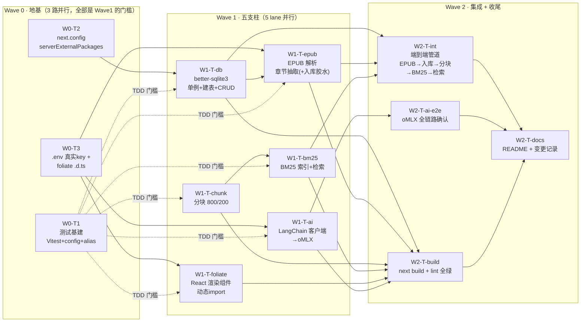

# M0 技术验证阶段 · 并行任务分解（Work Breakdown）

> 本文档为**规划产物**，不含任何代码实现。
> 目标：为 M0（5 大技术支柱验证）给出可派发的并行任务图（waves + 依赖）、每任务 TODO（含 category 路由 / load_skills / 验证方式）、可观察的二进制验收标准、以及必须避开的坑。
> 项目：`/home/huangaf/projects/help-you-read/reader/`（Next.js 16.3.4 + TS 5.9 + Tailwind v4）

---

## 0. 前置事实核查（规划前已实测，规划强依赖）

| 项 | 实测结论 | 对规划的影响 |
|----|---------|-------------|
| **测试运行器** | `package.json` 无 `test` 脚本，`node_modules` 无 vitest/jest/mocha/ava | ❗ **TDD 的硬性前置门槛**：必须先装测试基建（Wave 0），否则"先 RED 后 GREEN"无从谈起 |
| **oMLX 鉴权** | `GET /v1/models` 无 key→`"API key required"`；`Bearer dummy`→`"Invalid API key"`；**当前实例校验 key，"dummy" 假设会失败** | ❗ 可用 key = 环境变量 **`$OMLX_API_KEY`**（已设置，35 位）；opencode 配置 `omlx.apiKey = {env:OMLX_API_KEY}`。M0 的 `.env` 必须填**真实 key**，不能用 `dummy` |
| **foliate-js 1.0.1 形态** | 无 `main`/`module`/`types` 字段，`exports` 仅 `"./*.js": "./*.js"`，`type:module`；`epub.js` **具名导出 `EPUB`**（非 default）；`view.js` 为**副作用**导入（注册 `<foliate-view>` 自定义元素）；`vendor/` 自带 `fflate.js`+`zip.js`（自包含，无运行时 npm 依赖） | 需本地 `.d.ts` 补类型；`epub.js` 走**服务端**解析需 `DOMParser` polyfill（Node 无此全局，见坑 #4） |
| **foliate-js 浏览器依赖** | `epub.js`/`view.js` 用到 `DOMParser`、`Blob`、`URL.createObjectURL` | Node 20 有 `Blob`/`URL`，**无 `DOMParser`** → 服务端解析需 polyfill 或换解析路径 |
| **Next 16.3.4** | Route Handler 默认 `nodejs`（可显式 `export const runtime='nodejs'`）；`serverExternalPackages` 是 App Router 下正确配置项；v15+ `GET` handler 默认 **dynamic**（非静态） | `better-sqlite3` 必须进 `serverExternalPackages`；M0 暂不实现业务 `GET`，缓存改动影响小但需知 |
| **tsconfig** | `paths: {"@/*": ["./src/*"]}`；`strict` | vitest 需显式配 `resolve.alias`（vite 默认不读 tsconfig paths） |
| **类型 / schema** | `src/types/index.ts` 完整（Book/Chapter/Highlight/… camelCase）；`schema.sql` 10 表 5 索引，全 `IF NOT EXISTS` 幂等 | DB 层做 camelCase↔snake_case 映射即可直接落库 |

> 结论：**5 大支柱彼此基本解耦**，唯一强依赖是 Wave 0 的三块地基 + Wave 1 内部的两个串行对（chunk→bm25、epub 入库胶水→db）。可大规模并行。

---

## 1. 并行任务图（Waves 与依赖）

### Wave 语义

- **Wave 0（地基，3 路并行）**：W0-T1 / W0-T2 / W0-T3 互相独立、体量小，可同一时间派发 3 个 agent。它们分别卡住"所有 TDD 工作""DB 层""AI+foliate 层"。**Wave 0 未全绿前，Wave 1 的 TDD 循环无法启动。**
- **Wave 1（五支柱，5 lane 并行）**：
  - `W1-T-db`、`W1-T-foliate`、`W1-T-ai` 三者互相独立 → 并行。
  - `W1-T-epub` 的**抽取核心**独立可先做；其**入库胶水**需等 `W1-T-db` 完成后接上。
  - `W1-T-chunk → W1-T-bm25` 是 lane 内**串行对**（bm25 吃 chunk 的产物）。
  - 综合：5 条 lane 同时开工，仅 chunk→bm25 内部串行。
- **Wave 2（集成 + 收尾）**：`W2-T-int`（依赖 db+epub+chunk+bm25）与 `W2-T-ai-e2e`（依赖 ai）可并行；`W2-T-build` 等全部 W1 完成；`W2-T-docs` 最后。

### 派发建议（哪些并行委派 deep / unspecified-high）

| Lane | 任务 | 路由 | 理由 |
|------|------|------|------|
| W0 | W0-T1 测试基建 | `unspecified-high` | 步骤明确、体量小 |
| W0 | W0-T2 next.config | `unspecified-high` | 单文件 1 行配置 |
| W0 | W0-T3 env+types | `unspecified-high` | 生成 .env + 一个 .d.ts |
| W1 | W1-T-db 数据层 | `deep` | 单例/映射/CRUD，易踩 native 模块坑 |
| W1 | W1-T-epub 解析 | `deep` | 需先做 DOMParser/解析路径 spike，复杂 |
| W1 | W1-T-chunk 分块 | `unspecified-high`（或 deep） | 纯函数简单，但中文边界需细心，边界多时升 deep |
| W1 | W1-T-bm25 索引 | `deep` | 分词策略 + 算法正确性 |
| W1 | W1-T-foliate 渲染 | `deep` | 浏览器专属、SSR/动态导入/无类型，最易翻车 |
| W1 | W1-T-ai 客户端 | `deep` | LangChain API + 鉴权 + structured 方法 |
| W2 | W2-T-int 集成 | `deep` | 串 5 步全链路 |
| W2 | W2-T-build / docs | `unspecified-high` | 跑命令 + 写文档 |

> 并行度上限：Wave 1 同时挂 5 个 agent（db/epub/chunk-lane/foliate/ai）。受限于"epub 入库胶水等 db"，epub lane 会在 db 完成后自动接胶水，不阻塞其它 lane。

---

## 2. 每任务 TODO（category 路由 / load_skills / 验证方式）

> 通用纪律（所有 Wave 1 任务）：**TDD**——每个生产改动先写失败测试（RED）→ 最小实现（GREEN）→ 重构。`load_skills: [test-driven-development]`；调试卡点追加 `systematic-debugging`。每个 lane 完成后自跑 `npx vitest run <该lane测试>` 绿 + 类型 `npx tsc --noEmit` 无该文件报错。

### W0-T1 测试基建
- **category**：`unspecified-high`　**load_skills**：`[test-driven-development]`
- TODO：
  1. 安装 `vitest`（+ `@vitest/coverage-v8` 可选）、`jsdom`、`@testing-library/react`、`vite-tsconfig-paths`（或手写 alias）为 devDependencies
  2. `package.json` 加 `test: "vitest run"` / `test:watch: "vitest"`
  3. `vitest.config.ts`：`environment` 默认 `node`、`alias '@'→'./src'`、`setupFiles`（如需）、按文件 `// @vitest-environment jsdom` 切组件测试
  4. 写一个 smoke 测试（纯断言）确认 runner 可跑、alias 可解析
- **验证**：`npm run test` 跑通 smoke；`@/types` 能 import 不报错
- **验收（二进制）**：`npm run test` 退出码 0；smoke 测试 1 绿；alias 解析测试 1 绿

### W0-T2 next.config 原生模块
- **category**：`unspecified-high`　**load_skills**：`[systematic-debugging]`
- TODO：
  1. `next.config.ts` 加 `serverExternalPackages: ["better-sqlite3"]`
  2. 确认 prebuilt 二进制可加载（`node -e "require('better-sqlite3')"` 不报 `NODE_MODULE_VERSION` / 下载失败）；必要时 `npm rebuild better-sqlite3`
- **验证**：`node -e "new (require('better-sqlite3'))(':memory:').exec('create table t(a)')"` 成功；`npx next build`（可只验证不报 bundle 错）
- **验收（二进制）**：`node` 一行加载 better-sqlite3 退出码 0；`next build` 不再出现 better-sqlite3 相关打包错误

### W0-T3 环境变量 + foliate 类型
- **category**：`unspecified-high`　**load_skills**：`[omlx-cli]`（确认 oMLX 接口/模型名/鉴权）
- TODO：
  1. `cp .env.example .env`，填 `LLM_BASE_URL=http://100.126.215.3:8090/v1`、`LLM_API_KEY=$OMLX_API_KEY 的实际值`、`LLM_MODEL=Qwen3.5-122B-A10B-RAM-60GB-MLX`；`EMBEDDING_*` 暂标 M1 或给本地占位
  2. 新增 `src/types/foliate.d.ts`：`declare module 'foliate-js/view.js'`（副作用，无导出）、`declare module 'foliate-js/epub.js' { export class EPUB {...} }`、`declare global { interface HTMLElementTagNameMap { 'foliate-view': ... } }`
  3. `tsc --noEmit` 确认 foliate 相关 import 不再报"找不到模块/类型"
- **验证**：`npx tsc --noEmit` 全绿；`.env` 被 `.gitignore` 忽略（不入库）
- **验收（二进制）**：`tsc --noEmit` 退出码 0；`git status` 中 `.env` 不出现（已忽略）

### W1-T-db 数据层（better-sqlite3）
- **category**：`deep`　**load_skills**：`[test-driven-development, systematic-debugging]`
- TODO：
  1. RED：写测试——连接单例（同一进程两次取到同一实例）、建表幂等（连执行两遍 schema 不报错）、books/chapters 的 insert→select 回读一致、list/update/delete
  2. GREEN：`src/lib/db/index.ts`——`globalThis` 缓存单例（防 HMR 重建）、`new Database(path)`（路径支持 env 覆盖，默认 `data/library.db`，测试用临时路径）、`db.exec(schemaSql)`、开启 `PRAGMA foreign_keys=ON`
  3. 写 CRUD 帮助函数（insertBook/insertChapter/getChapter/listChapters/updateBook/…），内部做 snake_case↔camelCase 映射，对外吐 `src/types` 的类型
  4. 确保仅在服务端被 import（客户端组件禁止 import 本模块）
- **验证**：`npx vitest run src/lib/db`；用临时 db 文件，测试后清理；`next build` 通过
- **验收（二进制）**：CRUD 单测全绿；"建表连跑 2 次"测试绿（幂等）；insert→get 字段逐一对齐测试绿；`require('better-sqlite3')` 在测试进程内可加载

### W1-T-epub EPUB 解析
- **category**：`deep`　**load_skills**：`[test-driven-development, systematic-debugging]`
- TODO：
  1. **Spike（先做，30min 决策）**：装一个 DOMParser polyfill（`@xmldom/xmldom` 或 `linkedom`）→ Node 里 `import { EPUB } from 'foliate-js/epub.js'` 并对一个真实 EPUB buffer 调 `open()`，验证能否吐出 spine/chapters/text。
     - ✅ 能跑 → 复用 foliate（免费拿到 CFI，浏览器/服务端一致）
     - ❌ 跑不通 → 回退方案 B：Node 侧 `fflate`（foliate vendor 自带）解 zip + XML 解析 OPF spine + 逐 XHTML 去标签取正文（cfi 置 null，留 M1）
  2. RED：对 fixture EPUB 的测试——解析出章节数、每章 `title`/`content` 非空、`charCount` 合理
  3. GREEN：`parseEpub(input)` 返回 `{ meta, chapters: [{index,title,content,cfi?,charCount}] }`（纯函数，输入 ArrayBuffer/Buffer/FilePath）
  4. 胶水 `importEpubToDb(bookFile)`：parse → 写 books + chapters（**此步等 W1-T-db 完成再接**）
- **验证**：准备 1 个真实小 EPUB fixture（放 `test/fixtures/`）；`npx vitest run src/lib/parser`
- **验收（二进制）**：fixture 解析章节数 == 预期；每章 content 长度 > 阈值；入库后 `chapters` 表行数 == 解析章节数（接 db 后）；Spike 结论已记录（走 A 或 B）

### W1-T-chunk 分块
- **category**：`unspecified-high`（边界多则升 `deep`）　**load_skills**：`[test-driven-development]`
- TODO：
  1. RED：`chunkText(text,{size=800,overlap=200})` 的测试——块长≤800、相邻块重叠恰 200、末尾残块、空/短文本、总字符守恒
  2. GREEN：按**字符数**切分（中文无空格，按 `[...str]` 码点计数），返回 `{text,index,charCount,startOffset}` 数组
- **验证**：`npx vitest run src/lib/indexer/chunker`（node env，纯函数）
- **验收（二进制）**：所有边界测试绿；overlap 精确 200 的断言绿；块数/总长守恒断言绿

### W1-T-bm25 索引
- **category**：`deep`　**load_skills**：`[test-driven-development, systematic-debugging]`
- TODO：
  1. 定分词策略（M0 建议内置轻量：CJK 按字符/bigram + 拉丁按词，避免引入重依赖）
  2. RED：对合成语料——`buildIndex(chunks)` + `search(query, k)` 返回正确块且排序合理（目标块进 topK）、命中/未命中区分、空索引/空查询不崩
  3. GREEN：实现 BM25（idf + 词频 + 长度归一化 k1/b 可调）
- **验证**：`npx vitest run src/lib/indexer/bm25`
- **验收（二进制）**：合成语料检索"目标块在 top3"测试绿；空查询/空索引边界绿

### W1-T-foliate 渲染组件
- **category**：`deep`　**load_skills**：`[test-driven-development, webapp-testing, systematic-debugging]`
- TODO：
  1. 新建 `src/components/reader/FoliateView.tsx`（`"use client"`）
  2. RED（jsdom）：SSR 渲染不执行 foliate import（占位/空）、client 挂载后触发 `useEffect` 动态 `import('foliate-js/view.js')` + `document.createElement('foliate-view')`
  3. GREEN：`useEffect` 内动态导入（带 `typeof window==='undefined'` 守卫）；`ArrayBuffer` → `new Blob([buf])` → `view.open(blob)`；监听 `relocate` 事件上报位置
  4. 浏览器冒烟：`next dev` 打开 `/read/[bookId]`，传入真实 EPUB
- **验证**：jsdom 结构测试 + **`webapp-testing`（Playwright）或 `agent-browser`** 开真浏览器截屏/取文本
- **验收（二进制）**：`next dev` 下页面渲染出**可见章节文字**（Playwright 断言正文文本存在）；SSR 无报错、控制台无未捕获异常；jsdom 守卫测试绿

### W1-T-ai LangChain 客户端
- **category**：`deep`　**load_skills**：`[test-driven-development, omnx-cli, systematic-debugging]`
- TODO：
  1. RED：`buildLlm()` 返回 ChatOpenAI（`apiKey`/`baseURL`/`model` 读 `.env`，`streamUsage:false`）；`chat()` 返回非空 content；`structured(schema)` 走 `withStructuredOutput({method:'functionCalling'})` 且结果过 zod
  2. GREEN：`src/lib/ai/client.ts` 封装 `chat` / `chatStream` / `structured`；错误转可读消息
  3. **注意**：连通性测试打的是**活体 oMLX**，属集成/冒烟——用 env 开关（如 `RUN_LLM=1`）可跳过，避免 CI 因 oMLX 下线而红
- **验证**：`RUN_LLM=1 npx vitest run src/lib/ai`（真实 key 来自 `.env`）
- **验收（二进制）**：`chat()` 返回 HTTP 200 且 `content` 非空；`structured` 结果 `schema.safeParse` 通过；错误路径抛可读错误（非栈）

### W2-T-int 端到端管道
- **category**：`deep`　**load_skills**：`[systematic-debugging]`
- TODO：写一个可执行脚本/测试：真实 EPUB → `parseEpub` → 入库 → `chunkText` → `buildIndex` → `search`，逐步打印
- **验收（二进制）**：一条命令跑通 5 步，每步有可观察输出；检索 topK 内容合理；退出码 0

### W2-T-build / W2-T-docs
- **category**：`unspecified-high`　**load_skills**：`[verification-before-completion]`
- TODO：`npm run build` + `npm run lint` 全绿；更新 README（M0 能力/如何跑）+ 在方案文档追加「变更记录」
- **验收（二进制）**：`next build` 退出码 0；`eslint` 退出码 0

---

## 3. 验收标准汇总（可观察的二进制结果）

| 任务 | 验收命令 / 观察点 | 通过判据（二进制） |
|------|------------------|--------------------|
| W0-T1 测试基建 | `npm run test` | 退出码 0，smoke 1 绿 |
| W0-T2 next.config | `node -e "new (require('better-sqlite3'))(':memory:')"` + `next build` | 加载成功（退出码 0）+ 无 bundle 报错 |
| W0-T3 env+types | `npx tsc --noEmit`；`git status` | tsc 退出码 0；`.env` 不出现 |
| W1-T-db | `npx vitest run src/lib/db` | CRUD 全绿 + 建表幂等绿 + 单例同一引用 |
| W1-T-epub | `npx vitest run src/lib/parser` | fixture 章节数==预期；入库后表行数==解析数 |
| W1-T-chunk | `npx vitest run src/lib/indexer/chunker` | overlap==200 断言绿 + 守恒绿 |
| W1-T-bm25 | `npx vitest run src/lib/indexer/bm25` | 目标块进 top3 绿 + 边界不崩 |
| W1-T-foliate | `next dev` + Playwright/agent-browser | 视口出现可见正文文本；SSR 无错、无未捕获异常 |
| W1-T-ai | `RUN_LLM=1 npx vitest run src/lib/ai` | `content` 非空（200）+ structured 过 zod |
| W2-T-int | 跑集成脚本 | 5 步全通 + 退出码 0 |
| W2-T-build | `npm run build` + `npm run lint` | 两个退出码均 0 |

> 全量门禁：`npm run test` && `npm run build` && `npm run lint` 三者退出码 0，且 foliate 浏览器冒烟出可见正文 → **M0 通过**。

---

## 4. 坑与风险（必须规避）

1. **❗ 无测试运行器**：项目当前**没有任何**测试基建。TDD 的 RED→GREEN 无从落地。**必须先做 W0-T1**，它是 Wave 1 全部 lane 的硬门槛。不要假装"已有 test 命令"。

2. **❗ oMLX 的 "dummy" 假设会失败**：本实例（`100.126.215.3:8090`）**校验 API key**——无 key 报 `API key required`，`dummy` 报 `Invalid API key`。可用 key 是 **`$OMLX_API_KEY`**（35 位，已设）。`.env` 的 `LLM_API_KEY` 必须填**真实值**；`ChatOpenAI` 的 `apiKey:"dummy"` 技巧**只适用于不校验的网关**，这里不适用。模型名用 `Qwen3.5-122B-A10B-RAM-60GB-MLX`（勿用 gpt-5/o 开头）。

3. **❗ better-sqlite3 = 原生 CJS 模块**：
   - 必须进 `serverExternalPackages`，否则 Next 打包会失败/运行时报 native 错。
   - **只能在服务端**（Route Handler / server 组件 / lib 被服务端引用）；客户端组件 import 会触发浏览器打包 native 模块 → 崩。
   - 用 **globalThis 单例**防 HMR 反复 `new Database` 锁库/重连。
   - prebuilt 二进制加载失败（`NODE_MODULE_VERSION` / 下载被墙）时先 `npm rebuild better-sqlite3`——这会在 W0-T2 暴露，别拖到 DB 层才发现。

4. **❗ foliate-js 走服务端解析需要 DOMParser**：Node 20 有 `Blob`/`URL` 但**没有 `DOMParser`**，而 `epub.js` 解析 OPF/正文依赖它。复用 foliate 做服务端抽取 → 需 `@xmldom/xmldom`/`linkedom` polyfill；否则走"fflate 解 zip + XML 取正文"的独立路径（M0 下 CFI 可留空）。**这就是 W1-T-epub 的 Spike 要拍板的事**。

5. **❗ foliate-js 无类型 + ESM 副作用 + 纯浏览器**：
   - 无 `types` 字段 → 必须补本地 `.d.ts`（`view.js` 是副作用导入、`epub.js` 具名导出 `EPUB`）。
   - `view.js` 是**副作用**注册自定义元素 → 只能在浏览器 `useEffect` 里**动态** `import`；`import 'foliate-js/view.js'` 顶层静态导入会在 SSR 阶段执行并崩。
   - `ArrayBuffer` 需 `new Blob([buf])` 再 `open()`（`open` 接受 File/Blob/URL）。
   - 自定义元素 + zip 渲染 + Web Crypto（受保护字体需 secure context）→ **jsdom 测不出真实渲染**，验收必须用真浏览器（Playwright / agent-browser）。

6. **vitest 不读 tsconfig paths**：`@/*` 别名需在 `vitest.config.ts` 用 `resolve.alias` 显式声明（或 `vite-tsconfig-paths`），否则测试里 `@/types` import 失败。

7. **DB 文件路径 / 测试隔离**：`data/library.db` 确保 `data/` 存在且可写；测试必须用**临时路径**（env 覆盖），别污染真实 `data/`，测后清理。

8. **Next 16 Route Handler 默认 dynamic + nodejs**：M0 不实现业务 GET，影响小；但任何 `GET` 列表路由记得 v15+ 默认 dynamic（不再是静态），必要时显式 `export const runtime='nodejs'` / 缓存策略。

9. **连通性测试是活体依赖**：W1-T-ai 的"打 oMLX"测试依赖外部服务，应加 `RUN_LLM=1` 之类开关，避免 oMLX 下线导致 CI 全红（把"真实联通"与"纯逻辑单测"分层）。

10. **foliate-js 自包含但"不稳定"**：README 明说 "not stable, expect it to break, no release yet"。M0 验证通过即可，别把 foliate 的内部实现写死进业务；封装一层 `FoliateView` 隔离，后续升级只改一处。

---

## 5. 风险与回退（Top 3）

| 风险 | 概率 | 影响 | 缓解 / 回退 |
|------|------|------|------------|
| foliate 服务端解析（DOMParser polyfill）跑不通 | 中 | 支柱1 抽取受阻 | 回退方案 B（fflate+XML 独立解析），M0 下 CFI 留空 |
| oMLX 拒连（key/模型名/超时） | 中 | 支柱4 无法验收 | 用 `$OMLX_API_KEY` 真实 key；确认模型名；`RUN_LLM` 开关分层 |
| better-sqlite3 二进制加载失败 | 低-中 | 支柱5 全阻 | W0-T2 先 `npm rebuild`；提前暴露，不拖到 DB 层 |

> **执行顺序硬约束**：Wave 0 三块地基全绿 → 才启动 Wave 1 五 lane → Wave 2 集成/收尾。epub 的入库胶水在 db 完成后自动接上，不阻塞其它 lane。
